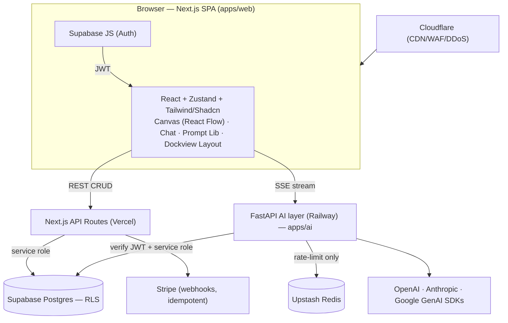

# ChatGRP — Project Plan

> Generated from PRD review (ChatGRP_PRD_v5.docx) on 2026-07-11

## 1. Product Overview

### Vision
ChatGRP is a **visual AI chat desktop for the web**. Instead of a single scrolling thread, every question-and-answer exchange becomes a **node** in an interactive graph. Users branch conversations from any historical node, switch the AI model per message, and navigate their entire thinking process as a living knowledge map. The core insight: linear chat loses context and exploration history — a canvas makes every conversation navigable, forkable, and revisitable.

### Target Users
Developers (architecture planning, debugging), researchers (exploring topics with many sub-questions), knowledge workers (brainstorming, comparing options), and students (learning a concept from multiple angles). All share the pain of losing context in linear chat and wanting to explore multiple directions from one question.

### Key Outcomes
- Turn every conversation into a navigable, branchable graph instead of a lossy linear scroll.
- Let users switch between GPT / Claude / Gemini models on any single message, priced transparently in credits.
- Ship a monetized SaaS (Free / Pro / Team) with credit quotas, a reusable Prompt Library, and a customizable dockable workspace.

---

## 2. Requirements Summary

### Functional Requirements

| ID | Domain | Requirement | Priority |
|----|--------|-------------|----------|
| FR-01 | Sessions | Create, name, load, and delete sessions; persist across refresh | Must-have |
| FR-02 | Canvas | Each Q+A creates one node; directed parent→child arrows; auto-layout; zoom/pan | Must-have |
| FR-03 | Canvas | Node shows question + truncated answer, model badge, credit cost | Must-have |
| FR-04 | Canvas | Collapse/expand branches; star/bookmark nodes; search nodes by content | Should-have |
| FR-05 | Chat Panel | Click node → open its branch; breadcrumb path root→node; full branch history | Must-have |
| FR-06 | Chat Panel | Send reply from any node; fork button creates sibling branch | Must-have |
| FR-07 | Model Switching | Model dropdown above every input; 6 models; selection applies to next message only; model ID stored on AI node | Must-have |
| FR-08 | Model Switching | Only models available on the user's plan are shown | Must-have |
| FR-09 | Context | AI receives full root→node path; sibling branches fully isolated; oldest pairs truncated if over limit (root preserved) | Must-have |
| FR-10 | Context | Token usage counter in chat panel | Should-have |
| FR-11 | Export | Export any branch as markdown with breadcrumb header | Should-have |
| FR-12 | UX | Light/dark mode w/ system detection; responsive; skeleton loaders; empty state onboarding | Should-have |
| FR-13 | Prompt Library | Save prompts (title, tags, folder); user-message vs system-prompt kinds; `{{variables}}`; quick-insert / slash command; default model per prompt; search/filter; star + recently-used; starter pack | Must-have (v5) |
| FR-14 | Prompt Library | Team sharing (private/team visibility); Free tier capped at 10 saved prompts | Should-have |
| FR-15 | Layout | Dockable panels (drag to dock zone, resizable splits, no overlap); show/hide/collapse; presets (Canvas focus, Split, Chat focus, Zen); save custom layouts | Must-have (v5) |
| FR-16 | Layout | Global default layout synced across devices; per-session override; responsive stacked/tabbed on small screens; custom layouts are Pro-gated | Should-have |
| FR-17 | Billing | Stripe subscriptions (Free/Pro/Team); credit system; monthly reset; usage ledger | Must-have |
| FR-18 | Billing | Hard credit cap enforced server-side; per-request input capped at 4,096 tokens | Must-have |

### Non-Functional Requirements

| ID | Category | Requirement | Target |
|----|----------|-------------|--------|
| NFR-01 | Performance | p95 AI response latency | < 3s |
| NFR-02 | Scale | Concurrent streaming connections | 500 peak |
| NFR-03 | Scale | Active users / throughput | 10,000 users, ~50 msg/user/day |
| NFR-04 | Security | API keys server-side only; Supabase RLS; Stripe signature verification; HTTPS everywhere | Enforced |
| NFR-05 | Security | Rate limiting via Redis; Cloudflare DDoS/WAF | Enforced |
| NFR-06 | Reliability | Generation lifecycle tracks pending/streaming/completed/failed/cancelled; no credit charge on fail/cancel | Auditable |
| NFR-07 | Observability | Sentry (errors) + PostHog (product analytics) + Axiom (logs) | Integrated |

### Assumptions
- Greenfield build; the existing v0.dev export (`app/`, `components/`, `lib/`) is a **visual reference skin**, not a runnable app (no `package.json`/config). It will be migrated into `apps/web`.
- The v0 UI's simplified data shape (`question`+`answer` on a node; 4 models) is superseded by the PRD's production schema (separate `messages` table; 6 models).
- AI generation is **mock-first** — real provider SDKs are wired at Phase 3 (Multi-Model).
- Single developer (or small team); rates for cost estimates assume a blended ~$80/hr.
- The exact model IDs will be refreshed at build time (providers have since shipped GPT-5 / Claude 4.6 / Gemini 3.x); credit values below are calibrated to current per-token prices.

### Open Questions
- Final model lineup: keep PRD's named models (GPT-4o, Claude Sonnet/Opus, Gemini Pro/Flash) or map to current-gen equivalents at Phase 3? (Recommend deciding at Phase 3.)
- Team tier: is there a team-invite / workspace-membership flow, or is `team_id` assigned manually for MVP? (PRD is silent; recommend minimal invite flow deferred to post-MVP.)

---

## 3. Architecture

### System Overview



**Backend ownership rule (from PRD):** if it touches an AI model, streaming, or generation → **FastAPI**. Everything else → **Next.js**.

### Component Breakdown

#### apps/web — Next.js 14 (App Router)
- **Responsibility:** All UI + all non-AI CRUD (sessions, nodes, prompts, folders, layouts, settings, export), auth, Stripe webhooks.
- **Key interfaces:** Consumes Next.js API routes (REST) and FastAPI (`/generate` SSE). Renders canvas via `@xyflow/react`, layout via `dockview`.
- **Technology:** Next.js 14, React 18, Zustand, Tailwind + Shadcn/ui, `@xyflow/react` v12, `dockview` v7.

#### apps/ai — FastAPI
- **Responsibility:** Streaming AI (SSE), context builder (walks `parent_id`), model router, token counting/budgeting, generation-attempt tracking, credit deduction to the usage ledger.
- **Key interfaces:** `POST /generate`, `DELETE /generate/:id/cancel`. Verifies Supabase JWT; uses service-role key for DB writes.
- **Technology:** FastAPI, `openai`, `anthropic`, `google-generativeai`, `tiktoken` (+ provider token counters), `sse-starlette`.

#### packages/shared
- **Responsibility:** Single source of truth for cross-service contracts — TypeScript types + Zod schemas for the API surface, model registry, and credit table. Mirrored to Python via generated/hand-kept Pydantic models.
- **Technology:** TypeScript, Zod.

#### Supabase Postgres
- **Responsibility:** Single source of truth for all durable data; RLS enforces per-user isolation.

#### Upstash Redis
- **Responsibility:** Rate limiting **only**. Never billing or session state (per PRD).

### Data Models

Nine tables. **Key separation of concerns:** a *node* owns graph structure; *messages* own content (2 per node); *generation_attempts* own the streaming/retry/token lifecycle; *usage_ledger* is the durable billing source of truth.

```
sessions
  id uuid pk · user_id uuid fk · name text · created_at ts
  layout jsonb null   -- per-session panel override; null = user default

nodes
  id uuid pk · session_id uuid fk · parent_id uuid self-fk (null = root)
  is_fork bool · starred bool · collapsed bool
  position_x float · position_y float · order_index int · created_at ts

messages
  id uuid pk · node_id uuid fk · session_id uuid fk
  role text ('user'|'assistant') · content text · created_at ts
  -- exactly 2 per node: one user, one assistant

generation_attempts
  id uuid pk · message_id uuid fk · node_id uuid fk · model_id text
  status text ('pending'|'streaming'|'completed'|'failed'|'cancelled')
  error text null · tokens_input int · tokens_output int
  started_at ts · completed_at ts

usage_ledger
  id uuid pk · user_id uuid fk · generation_attempt_id uuid fk
  credits_used int · model_id text · created_at ts
  -- single source of truth for credit usage (NOT Redis)

saved_prompts
  id uuid pk · user_id uuid fk · team_id uuid null fk
  title text · body text · kind text ('user_prompt'|'system_prompt')
  variables jsonb · tags text[] · folder_id uuid null fk
  default_model_id text null · visibility text ('private'|'team')
  usage_count int · last_used_at ts null · created_at ts · updated_at ts

prompt_folders
  id uuid pk · user_id uuid fk · name text · created_at ts

layouts
  id uuid pk · user_id uuid fk · name text
  tree jsonb  -- dock arrangement, panel sizes, visibility
  created_at ts · updated_at ts

user_settings
  id uuid pk · user_id uuid fk unique
  default_layout_id uuid null fk · created_at ts · updated_at ts
```

RLS policy pattern: every table with `user_id` gets a policy `user_id = auth.uid()`; child tables (`nodes`, `messages`, `generation_attempts`) authorize via a join to the owning `session`/`user`.

### API Surface

**Next.js API Routes** (auth required unless noted):

| Method | Endpoint | Description |
|--------|----------|-------------|
| GET | `/sessions` | List user's sessions |
| POST | `/sessions` | Create session |
| PATCH | `/sessions/:id` | Rename session |
| DELETE | `/sessions/:id` | Delete session + nodes + messages (cascade) |
| GET | `/sessions/:id/nodes` | Fetch all nodes + messages for a session |
| PATCH | `/nodes/:id` | Update node state (star, collapse, position x/y) |
| GET | `/nodes/:id/export` | Export branch as markdown |
| POST | `/webhooks/stripe` | Stripe subscription events (idempotency key) — no user auth, signature-verified |
| GET/POST | `/prompts` | List (filter by tag/folder/search) / create saved prompt |
| PATCH/DELETE | `/prompts/:id` | Update / delete saved prompt |
| POST | `/prompts/:id/use` | Increment usage_count, set last_used_at |
| GET/POST | `/prompt-folders` | List / create folder |
| DELETE | `/prompt-folders/:id` | Delete folder (prompts become unfiled) |
| GET/POST | `/layouts` | List / save named layout |
| PATCH/DELETE | `/layouts/:id` | Update / delete layout |
| PATCH | `/settings` | Update user settings (default layout) |
| PATCH | `/sessions/:id/layout` | Set/clear per-session layout override |

**FastAPI Routes:**

| Method | Endpoint | Description |
|--------|----------|-------------|
| POST | `/generate` | Save user message; build context (walk parent_id); count/budget tokens; call model; stream via SSE; save assistant message; record generation_attempt; deduct credits atomically to usage_ledger |
| DELETE | `/generate/:id/cancel` | Cancel in-progress generation; mark attempt cancelled; discard partial; no credit charge |

### Tech Stack

| Layer | Technology | Rationale |
|-------|-----------|-----------|
| Frontend | Next.js 14 (App Router) + React 18 | PRD-specified; App Router for streaming-friendly RSC + route handlers |
| Canvas | `@xyflow/react` v12 (React Flow) | Pan/zoom, auto-layout, minimap, custom nodes, partial re-render for free — saves ~2-3 wk vs hand-rolled SVG |
| Layout | `dockview` v7 | Zero-dep VS Code-style docking; JSON serialize/restore maps directly to `layouts.tree` |
| State | Zustand | PRD-specified; lightweight, good fit for canvas + panel state |
| Styling | Tailwind CSS + Shadcn/ui | PRD-specified; already used by the v0 UI |
| Non-AI backend | Next.js API Routes on Vercel | Co-located with frontend; owns CRUD/auth/Stripe |
| AI backend | FastAPI on Railway | Best Python AI SDK ecosystem; isolates streaming/model-routing from CRUD |
| Database | Supabase Postgres (+ RLS) | Single source of truth; RLS enforces per-user isolation |
| Cache | Upstash Redis | Rate limiting only |
| Auth | Supabase Auth (email + Google OAuth) | PRD-specified; JWT verifiable in both backends |
| Payments | Stripe + webhooks (idempotent) | Industry standard; webhooks handled in Next.js |
| Streaming | SSE via FastAPI (`sse-starlette`) | PRD-specified |
| Monitoring | Sentry + PostHog + Axiom | Errors + product analytics + logs |
| CDN/Security | Cloudflare | DDoS + WAF + CDN |
| Monorepo | pnpm workspaces | `apps/web` + `apps/ai` + `packages/shared`, shared contracts |

### Detected Stack Constraints
**Greenfield** — no runnable project detected. The only pre-existing code is a **partial v0.dev UI export** (Next.js App Router + Tailwind + Shadcn + custom SVG canvas) with no build config. It constrains the frontend toward **Next.js App Router + Tailwind + Shadcn** (already aligned with the PRD) and provides ready-made marketing, auth, pricing, and app-shell pages to reuse.

### Shared Interfaces

| Interface | Location | Purpose | Depended on by |
|-----------|----------|---------|----------------|
| `MODELS` registry + `ModelId` | `packages/shared/models.ts` | Model list, provider, credit cost, plan availability | Model Switching, Canvas badges, Billing, Prompt Library default-model |
| `CREDIT_TABLE` | `packages/shared/credits.ts` | Adjusted per-model credit cost (see §7) | Billing, Generate flow, Canvas |
| API types + Zod schemas | `packages/shared/api.ts` | Request/response contracts for all routes | Every feature, both backends |
| `Node` / `Message` / `GenerationAttempt` types | `packages/shared/graph.ts` | Graph + content data shapes | Canvas, Chat Panel, Context builder, Branching |
| `buildContext(nodeId)` contract | `apps/ai` (impl) + `packages/shared` (types) | Walk parent_id → messages array | Chat Panel, Multi-Model, Branching |
| Supabase JWT verify util | `apps/ai/auth.py` | Verify Supabase token in FastAPI | Every FastAPI route |
| `deductCredits()` atomic tx | `apps/ai` | Atomic Postgres credit deduction + ledger write | Generate flow, Billing quota enforcement |
| Auth/session guard | `apps/web/lib/auth.ts` | Verify user on every Next.js route | Every non-AI feature |

---

## 4. Strategy

### Build vs. Buy
| Capability | Decision | Rationale |
|-----------|----------|-----------|
| Auth | Buy (Supabase Auth) | Email + Google OAuth out of the box, JWT verifiable in both services |
| Canvas engine | Open-source (React Flow) | Solves pan/zoom/layout/minimap; MIT-licensed, free |
| Dockable layout | Open-source (Dockview) | Solves docking/floating/serialize; zero-dep, free |
| Payments | Buy (Stripe) | Standard; webhooks + subscription management |
| AI inference | Buy (OpenAI/Anthropic/Google APIs) | Core value; pay per token, resold as credits |
| DB + RLS | Buy (Supabase) | Postgres + row-level security + realtime if needed |
| Streaming layer | Build (FastAPI) | Custom context builder + model router + credit logic |

### MVP Scope
**In (full v5):** Sessions, graph canvas, chat panel, per-message model switching (6 models), branch-isolated context, branching + fork, markdown export, billing + credits, **Prompt Library**, **customizable dockable layout**, light/dark, monitoring.
**Explicitly deferred (post-MVP):** Team-invite/workspace membership UX (beyond a `team_id` field), non-markdown export formats, nested prompt folders, mobile-native app, collaborative/real-time multi-user editing of a graph.

### Iteration Approach
Ship phase-by-phase to a live URL (see Deployment). After launch, watch the success metrics (§8 / PRD §11): free→pro conversion, avg nodes/session, session length, churn, p95 latency. Recalibrate the credit table against **real** usage after 30 days.

### Deployment Strategy
**Early "walking skeleton" deploy after Phase 0.** Wire Vercel (web) + Railway (ai) + Supabase + Stripe test mode + Cloudflare immediately, deploy a trivial authenticated app, then every subsequent phase ships to the real URL. This surfaces cross-service auth, CORS, and SSE-through-proxy issues early rather than at launch. CI/CD: GitHub → Vercel (auto) + Railway (auto on push); Supabase migrations via CLI in CI.

---

## 5. Project Structure

```
chatgrp/
├── apps/
│   ├── web/                      # Next.js 14 (migrated from v0.dev export)
│   │   ├── app/                  # App Router — reuse existing v0 pages
│   │   │   ├── (marketing)/      # landing, pricing, legal (from v0)
│   │   │   ├── (auth)/           # login, signup, reset, verify (from v0)
│   │   │   ├── app/              # the graph workspace (main product)
│   │   │   └── api/              # Next.js API routes (sessions, nodes, prompts, layouts, stripe)
│   │   ├── components/           # v0 components + new canvas/chat/prompt/layout
│   │   │   ├── canvas/           # React Flow custom nodes, edges, controls
│   │   │   ├── chat/             # chat panel, breadcrumb, input, model dropdown
│   │   │   ├── prompts/          # prompt library panel, editor, variable-fill
│   │   │   ├── layout/           # Dockview integration, presets
│   │   │   └── ui/               # Shadcn primitives (from v0)
│   │   ├── lib/                  # supabase client, auth guard, zustand stores, api client
│   │   └── package.json
│   └── ai/                       # FastAPI AI layer
│       ├── app/
│       │   ├── routes/           # generate.py, cancel.py
│       │   ├── context.py        # parent_id walker + token budgeting
│       │   ├── router.py         # model router (openai/anthropic/google)
│       │   ├── credits.py        # atomic deduction + usage_ledger
│       │   ├── auth.py           # Supabase JWT verify
│       │   └── db.py             # supabase service-role client
│       ├── pyproject.toml
│       └── Dockerfile
├── packages/
│   └── shared/                   # TS types + Zod schemas + model/credit registry
│       ├── models.ts · credits.ts · api.ts · graph.ts
├── supabase/
│   ├── migrations/               # SQL schema + RLS policies
│   └── seed.sql                  # starter prompt pack
├── pnpm-workspace.yaml
├── turbo.json                    # (optional) task orchestration
└── PROJECT_PLAN.md
```

---

## 6. Implementation Plan

### Timeline
- **Start date:** TBD
- **Target completion:** ~12 weeks from start (full v5 scope, dual backend, single dev)
- **Total estimated duration:** ~12 weeks / ~12 person-weeks

> The PRD's 8-week milestone list assumed a lighter scope. With Prompt Library + dockable Layout included in the MVP and a dual-backend setup, ~12 weeks is realistic. Compress by deferring Prompt Library/Layout if the deadline tightens.

---

### Phase 0: Scaffold & Foundation — ~1 week

**Goal:** A deployed, authenticated empty app on the real infrastructure, with the full DB schema live.

**Features Completed:**
- Auth — user can sign up (email + Google) and log in.
- App shell — the migrated v0 UI renders with routing.

**Deliverables:**
- [ ] pnpm monorepo (`apps/web`, `apps/ai`, `packages/shared`)
- [ ] Migrate v0 export into `apps/web`; add `package.json`, `next.config`, `tsconfig`, `tailwind.config`, `components.json`; install deps (lucide-react, etc.)
- [ ] FastAPI skeleton in `apps/ai` with `/health` + Supabase JWT verify
- [ ] Supabase project; all 9 tables + RLS migrations; seed starter prompt pack
- [ ] Supabase Auth (email + Google OAuth) wired to v0 login/signup pages
- [ ] Deploy skeleton: Vercel (web) + Railway (ai) + Cloudflare + Stripe test keys
- [ ] `packages/shared` scaffolding (model registry, credit table, API types)

**Key Tasks:**
1. `pnpm init` workspace; move `app/ components/ lib/ public/` into `apps/web`; reconcile imports.
2. Write SQL migrations for all 9 tables with RLS policies; apply via Supabase CLI.
3. Stand up FastAPI with a JWT-verify dependency that decodes the Supabase token.
4. Configure CORS + SSE passthrough between web and ai; set env vars in both hosts.

**How to Test Locally:**
```bash
pnpm install
pnpm --filter web dev        # http://localhost:3000
pnpm --filter ai dev         # http://localhost:8000 (uvicorn)
```
- Visit `http://localhost:3000` — the v0 landing page renders.
- Visit `/signup`, create an account (email + Google) — you land in `/app` authenticated.
- `curl http://localhost:8000/health` → `{"ok": true}`.
- `curl http://localhost:8000/generate` without a token → 401; with a valid Supabase JWT → passes auth.

**Success Criteria:** Deployed URL loads, real login works, all tables exist with RLS, both services healthy.

**Risks:** v0 export missing config/deps (mitigate: scaffold fresh `create-next-app`, copy source in). Cross-service JWT verification mismatch (mitigate: test with a real Supabase token early).

---

### Phase 1: Sessions & Graph Canvas — ~1.5 weeks

**Goal:** Persisted sessions and a real React Flow canvas rendering nodes from the database.

**Features Completed:**
- Session CRUD — create, rename, delete, load from sidebar; persists across refresh.
- Graph canvas — nodes + directed edges render on React Flow with pan/zoom/auto-layout.

**Deliverables:**
- [ ] Next.js routes: `GET/POST/PATCH/DELETE /sessions`, `GET /sessions/:id/nodes`, `PATCH /nodes/:id`
- [ ] Sessions sidebar wired to real data (reuse v0 `app-sidebar.tsx`)
- [ ] Canvas rebuilt on `@xyflow/react` with a custom node type styled after the v0 node design
- [ ] Auto-layout (dagre/elk); persist `position_x/y`, `collapsed`, `starred`, `order_index`
- [ ] Zustand store for canvas + session state

**Key Tasks:**
1. Replace v0 `graph-canvas.tsx` SVG with React Flow; port node visuals into a custom node.
2. Map `nodes` + `messages` rows → React Flow nodes/edges via `parent_id`.
3. Persist node position/collapse/star through `PATCH /nodes/:id` (debounced).

**How to Test Locally:**
- In `/app`, create a session named "Test" — it appears in the sidebar and survives a refresh.
- Seed a few nodes (SQL or a dev button) — they render on the canvas with arrows parent→child.
- Drag a node, refresh — position persists. Star a node — persists.
- Zoom/pan works; minimap shows the graph.

**Success Criteria:** Sessions and node graph fully persist and render on React Flow with correct edges.

**Risks:** Auto-layout vs. persisted manual positions conflict (mitigate: manual position wins once set; auto-layout only for new nodes).

---

### Phase 2: Chat Panel & Mock Streaming — ~1.5 weeks

**Goal:** The full chat loop works end-to-end against a **mock** AI stream — no provider costs.

**Features Completed:**
- Chat panel — click node → branch opens, breadcrumb, full branch history, input + send.
- Generation lifecycle — user message saved, mock SSE stream, assistant message saved, node created, gen-attempt tracked.

**Deliverables:**
- [ ] FastAPI `POST /generate` with **mock** token stream over SSE + `DELETE /generate/:id/cancel`
- [ ] Context builder: walk `parent_id` root→node → messages array (branch-isolated)
- [ ] Message + node + generation_attempt records written with correct lifecycle states
- [ ] Chat panel UI (reuse v0 `chat-panel.tsx`): breadcrumb, streaming render, cancel
- [ ] New node appears on canvas when a generation completes

**Key Tasks:**
1. Implement `buildContext()` walking `parent_id`; assert siblings never bleed in.
2. Mock streamer emits fake tokens over `sse-starlette`; frontend consumes via `EventSource`/fetch stream.
3. Wire lifecycle: `pending → streaming → completed`; on cancel → `cancelled`, discard partial.

**How to Test Locally:**
- Click a node → chat panel opens with breadcrumb root→node and the branch's messages.
- Type a message, send → mock tokens stream into the panel; a new node appears on the canvas wired to its parent.
- Open a sibling branch — its context does NOT contain the other branch's messages (verify in the request payload / logs).
- Start a generation and hit cancel → partial text discarded, attempt marked `cancelled`.

**Success Criteria:** Full send→stream→persist→new-node loop works with mock AI; context is branch-isolated.

**Risks:** SSE buffering through Cloudflare/Vercel proxies (mitigate: test streaming on the deployed URL this phase, set `no-buffering` headers).

---

### Phase 3: Multi-Model (Real AI) — ~1.5 weeks

**Goal:** Swap mock for real providers; switch models per message with badges and token accounting.

**Features Completed:**
- Model switching — dropdown above input; 6 models; applies to next message only; model badge on node.
- Real streaming — OpenAI / Anthropic / Google via a model router; token counting + budgeting; `/cancel` works on real streams.

**Deliverables:**
- [ ] Model router in FastAPI (`openai`, `anthropic`, `google-generativeai`)
- [ ] Replace mock streamer with real provider streams (normalized SSE)
- [ ] Token counting per provider; enforce 4,096-token input cap + context truncation (oldest pairs first, root preserved)
- [ ] `model_id` stored on assistant node; badge + credit cost on canvas
- [ ] Model dropdown (reuse v0 `select`) filtered by plan (stub plan = "all" until Phase 5)
- [ ] Token usage counter in chat panel; `tokens_input/output` on each attempt

**Key Tasks:**
1. Finalize model lineup (PRD names vs current-gen); populate `packages/shared/models.ts`.
2. Implement per-provider streaming adapters returning a uniform token stream.
3. Implement token budgeting: count full path, drop oldest pairs if over model limit, always keep root.

**How to Test Locally:**
- Select GPT-4o, send a message → real streamed answer; node shows GPT-4o badge + credits.
- Switch to Claude, send from the same node → next message uses Claude; prior nodes keep their own model.
- Send a message on a deep branch that exceeds context → oldest pairs dropped, root retained (check logs).
- Cancel mid-stream → provider request aborted, no assistant message saved.

**Success Criteria:** Real answers from all three providers; per-message model switching; token budgeting correct.

**Risks:** Provider API/key/version drift (mitigate: pin SDK versions, keep keys server-side, add a provider-down fallback message).

---

### Phase 4: Branching, Fork & Export — ~1.5 weeks

**Goal:** Full graph exploration — reply anywhere, fork siblings, collapse, star, search, export.

**Features Completed:**
- Branching — reply to any node creates a child; fork creates a sibling branch.
- Canvas power features — collapse/expand branches, star/bookmark, search nodes by content.
- Export — any branch → markdown with breadcrumb header.

**Deliverables:**
- [ ] Reply-from-any-node and fork (sets `is_fork`, new `order_index` among siblings)
- [ ] Collapse/expand branch (hide subtree; persist `collapsed`)
- [ ] Node content search → jump/center on match
- [ ] `GET /nodes/:id/export` → markdown with breadcrumb path header
- [ ] Star filter/highlight on canvas

**Key Tasks:**
1. Fork logic: create sibling under the same parent; ensure context still walks only its own lineage.
2. Collapse: hide descendant nodes/edges in React Flow while preserving layout on expand.
3. Export: assemble breadcrumb + ordered messages of the branch into markdown.

**How to Test Locally:**
- Reply to a historical node → new child branch; older siblings untouched.
- Fork a node → a new sibling branch appears; its context excludes the other sibling.
- Collapse a branch → subtree hides; expand → returns. Star a node → shows in starred filter.
- Search "sharding" → canvas centers the matching node.
- Export a branch → downloaded `.md` starts with the breadcrumb path, then the conversation.

**Success Criteria:** Users can branch/fork/collapse/star/search and export any branch to correct markdown.

**Risks:** Layout jank on collapse/expand of large graphs (mitigate: animate, cap re-layout scope).

---

### Phase 5: Billing & Credits — ~1.5 weeks

**Goal:** Real subscriptions, credit quotas enforced, plan-gated models.

**Features Completed:**
- Subscriptions — Stripe checkout for Free/Pro/Team; webhooks sync plan.
- Credits — per-message deduction to usage_ledger; hard cap enforced; monthly reset; plan-gated model list; credits counter.

**Deliverables:**
- [ ] Stripe products/prices (Pro $12, Team $30/user); checkout + billing portal
- [ ] `POST /webhooks/stripe` with signature verification + idempotency keys; sync subscription → user plan
- [ ] Atomic credit deduction in `/generate` (Postgres tx writing `usage_ledger`, guarded by monthly total vs plan cap)
- [ ] Hard-cap enforcement: block generation when over quota; friendly upsell message
- [ ] Plan-gated model dropdown (Free: GPT-4o mini + Gemini Flash; Pro/Team: all)
- [ ] Credits counter (reuse v0 `CREDITS` widget) wired to real ledger totals; monthly reset via Redis TTL + ledger query
- [ ] **Adjusted credit table** (see §7) in `packages/shared/credits.ts`

**Key Tasks:**
1. Build the atomic deduction: single transaction checks `SUM(credits_used) this month + cost <= plan_cap`, inserts ledger row, else rejects.
2. Handle Stripe webhook events (`checkout.session.completed`, `customer.subscription.updated/deleted`) idempotently.
3. Gate model availability + credit counter by the synced plan.

**How to Test Locally:**
- Subscribe via Stripe test card → plan upgrades to Pro; all models unlock.
- Send messages until near the cap → counter decrements; at the cap, generation is blocked with an upsell.
- Run two concurrent generations near the cap → total never exceeds the cap (atomic check holds).
- Cancel a generation → no credits charged. Trigger a failed generation → no credits charged.
- Replay a Stripe webhook → no double-processing (idempotency).

**Success Criteria:** Paid upgrade works, credits deducted atomically and audibly, hard cap holds under concurrency, models gated by plan.

**Risks:** Race conditions on concurrent streams (mitigated by atomic tx); webhook idempotency (mitigated by idempotency keys + event-id dedupe).

---

### Phase 6: Prompt Library — ~1.5 weeks

**Goal:** A full personal (and team) prompt knowledge base with variables and quick-insert.

**Features Completed:**
- Prompt CRUD + folders — save, edit, delete, organize; user-message vs system-prompt kinds.
- Insertion — `{{variables}}` filled at insert time; quick-insert from panel or slash command; default model applied.
- Discovery + sharing — search/filter, star, recently-used; team sharing; Free tier 10-prompt cap; starter pack seeded.

**Deliverables:**
- [ ] Routes: `GET/POST /prompts`, `PATCH/DELETE /prompts/:id`, `POST /prompts/:id/use`, `GET/POST /prompt-folders`, `DELETE /prompt-folders/:id`
- [ ] Prompt library panel (list, search, folder filter, star, recent)
- [ ] "Save prompt" action on any node/chat input; prompt editor with variable definitions
- [ ] Variable-fill dialog at insert; client-side insertion into the input (generation unchanged)
- [ ] Slash-command insert (e.g. `/summarize`); default model applied on insert
- [ ] Team visibility (private/team) via `team_id`; Free tier capped at 10 saved prompts
- [ ] Seed starter pack for new users (`supabase/seed.sql`)

**Key Tasks:**
1. Build prompt editor with `variables` schema (`{name,label,default}`); render fill dialog on insert.
2. Client-side insert into the message input — confirm streaming/context/credit paths are untouched.
3. Enforce Free-tier 10-prompt cap on create; `POST /prompts/:id/use` powers recently-used ordering.

**How to Test Locally:**
- Save a prompt with a `{{topic}}` variable + tags + folder → appears in the library.
- Insert it via `/`-command → fill dialog asks for `{{topic}}` → filled text lands in the input; default model auto-selected.
- Search/filter by tag and folder; star a prompt; "recently used" reorders after insert.
- As a Free user, try to save an 11th prompt → blocked with upgrade prompt.
- Share a prompt to team (Team plan) → visible to another team member; private prompts are not.
- New signup sees the seeded starter pack.

**Success Criteria:** Prompts save/organize/insert with variables and slash commands; tiers + team sharing enforced; generation path unchanged.

**Risks:** Variable templating edge cases (mitigate: escape/validate `{{...}}`, preview before insert).

---

### Phase 7: Customizable Layout — ~1.5 weeks

**Goal:** A dockable, savable workspace with presets, global default, and per-session override.

**Features Completed:**
- Dockable panels — Sessions/Canvas/Chat/Prompt panels dock, resize, show/hide/collapse via Dockview.
- Layout management — presets, save custom layouts, global default synced, per-session override, responsive fallback, Pro gating.

**Deliverables:**
- [ ] Dockview integration wrapping the 4 panels; serialize/restore `tree` jsonb
- [ ] Built-in presets as app constants (Canvas focus, Split 50/50, Chat focus, Zen)
- [ ] Routes: `GET/POST /layouts`, `PATCH/DELETE /layouts/:id`, `PATCH /settings`, `PATCH /sessions/:id/layout`
- [ ] Global default layout in `user_settings` synced across devices; per-session override (`sessions.layout`)
- [ ] Responsive stacked/tabbed view on small screens
- [ ] Pro-gate custom layout creation (presets free for all)

**Key Tasks:**
1. Wrap panels in Dockview; map its serialized model ↔ `layouts.tree`.
2. Resolve active layout: session override → user default → built-in preset.
3. Gate "save custom layout" behind Pro; presets always available.

**How to Test Locally:**
- Drag the Chat panel to dock beside the Canvas → snaps into a resizable split, no overlap.
- Switch presets (Canvas focus / Split / Chat focus / Zen) with one click.
- Rearrange, save as "My layout", set as global default → persists and appears on another device/browser.
- Give one session a custom override → other sessions still use the default.
- Free user: presets work, "save custom layout" is gated. Shrink the window → panels collapse to a stacked/tabbed view.

**Success Criteria:** Panels dock/resize/save; presets, global default, and per-session override all resolve correctly; Pro gating holds.

**Risks:** Dockview ↔ jsonb serialization drift across versions (mitigate: version the `tree` schema, migrate on read).

---

### Phase 8: Polish & Launch — ~1 week

**Goal:** Production hardening and observability.

**Features Completed:**
- Production UX — skeleton loaders, empty states, comprehensive error handling.
- Observability + security — Sentry, PostHog, Axiom, Cloudflare WAF, rate limiting.

**Deliverables:**
- [ ] Skeleton loaders on session/graph load; empty-state onboarding for new sessions
- [ ] Global error handling + user-friendly messages (reuse v0 `500`/`not-found`/`maintenance` pages)
- [ ] Dark-mode audit across new components (v0 already ships theme toggle)
- [ ] Sentry + PostHog + Axiom wired in both apps
- [ ] Redis rate limiting live; Cloudflare WAF rules; HTTPS enforced
- [ ] Final QA pass on all critical flows; load test toward 500 concurrent streams

**Key Tasks:**
1. Add skeletons/empty states; ensure every async surface has loading/error/empty states.
2. Instrument errors (Sentry), product events (PostHog), logs (Axiom) across web + ai.
3. Load-test streaming; verify p95 < 3s; tune Railway resources.

**How to Test Locally:**
- Throttle network → skeletons show, no layout shift; new session shows onboarding empty state.
- Force an error (kill ai service) → friendly error, not a stack trace; Sentry captures it.
- Exceed rate limit → 429 with a clear message.

**Success Criteria:** All states covered, monitoring live, rate limiting + WAF active, p95 latency < 3s, critical flows green.

**Risks:** 500-concurrent-stream memory on Railway (mitigate: load test, autoscale/queue, backpressure on SSE).

---

## 7. Cost Analysis

### Adjusted Credit Table (calibrated for uniform margin ~$0.0018/credit)

| Model | PRD credits | **Adjusted** | Why |
|-------|-------------|--------------|-----|
| GPT-4o mini | 2 | **2** | Already cheap for us — unchanged |
| Gemini Flash | 3 | **3** | Aligned — unchanged |
| GPT-4o | 10 | **10** | Healthy margin — unchanged |
| Claude Opus | 15 | **15** | Aligned — unchanged |
| **Claude Sonnet** | 8 | **10** | Was underpriced vs real output cost |
| **Gemini Pro** | 5 | **7** | Most underpriced per credit — biggest fix |

Result: every model earns roughly the same real profit per credit, so **margin is protected regardless of which model users pick** — the PRD's stated goal.

### Development Costs

| Phase | Effort | Paid tools during dev | Phase cost @ ~$80/hr |
|-------|--------|----------------------|----------------------|
| 0 · Scaffold | ~1 wk | Free tiers | ~$3,200 |
| 1 · Sessions/Canvas | ~1.5 wk | Free tiers | ~$4,800 |
| 2 · Chat/Mock | ~1.5 wk | Free tiers | ~$4,800 |
| 3 · Multi-Model | ~1.5 wk | ~$20 AI test spend | ~$4,820 |
| 4 · Branching/Export | ~1.5 wk | Free tiers | ~$4,800 |
| 5 · Billing | ~1.5 wk | Stripe test (free) | ~$4,800 |
| 6 · Prompt Library | ~1.5 wk | Free tiers | ~$4,800 |
| 7 · Layout | ~1.5 wk | Free tiers | ~$4,800 |
| 8 · Polish | ~1 wk | Monitoring free tiers | ~$3,200 |
| **Total** | **~12 wk** | **~$20** | **~$40,000** |

*Assumptions: single dev at a blended ~$80/hr, 40 hr/wk. As a solo-founder build, the cash cost is ~$20 (AI test spend) + infra below; the $40k is opportunity/labor value.*

### Operational Costs at Scale (monthly)

| Component | 100 users | 1K users | 10K users | 100K users |
|-----------|-----------|----------|-----------|------------|
| Vercel (web) | $20 | $20 | ~$40–67 | ~$150–400 |
| Supabase (DB) | $25 | $25 | ~$25–60 | ~$120–400 |
| Railway (ai) | $20 | $20 | ~$40–80 | ~$200–600 |
| Upstash Redis | Free–$10 | $10 | ~$10–19 | ~$60–120 |
| Cloudflare | Free | Free | Free–$20 | ~$20–200 |
| Monitoring | Free | Free | ~$0–75 | ~$100–400 |
| **Infra total** | **~$75–90** | **~$85–100** | **~$155–320** | **~$650–2,100** |
| AI API (variable) | pass-through, covered by credit revenue | | | |

*Assumptions: ~50 msg/user/day at target scale, 500 peak concurrent streams, 4,096-token input cap. AI cost is funded by subscription/credit revenue, not fixed infra. Pricing sources below.*

**Pro-tier unit economics (with adjusted credits):** $12/mo revenue, 2,000 credits → worst-case AI cost now ~$3.6/mo (was ~$8 under-adjusted), minus ~$0.70 Stripe + ~$0.50 infra alloc → **~$7+ net margin/heavy Pro user.**

### Alternative Cost Comparison

#### Backend architecture
| Option | @ 1K users | @ 100K users | Notes |
|--------|-----------|--------------|-------|
| **Dual (chosen)** | ~$40 (Vercel+Railway) | ~$350–1,000 | Selected — clean AI separation, Python SDK ecosystem |
| Single Next.js | ~$20 | ~$150–400 | Cheaper + one deploy, but streaming/model-routing in Node; deferred |

#### Canvas engine
| Option | Cost | Notes |
|--------|------|-------|
| **React Flow (chosen)** | $0 (MIT) | Saves ~2–3 wk dev (~$8–15k labor) |
| Custom SVG | $0 | Full control, but weeks of pan/zoom/layout work |

#### Layout engine
| Option | Cost | Notes |
|--------|------|-------|
| **Dockview (chosen)** | $0 | Serialize/restore matches `layouts.tree` |
| rc-dock | $0 | Viable, less active |
| react-resizable-panels | $0 | Simpler, loses drag-dock/floating/tabs |

### Cost Summary

| Category | Low | High |
|----------|-----|------|
| Total development (labor value) | ~$36,000 | ~$44,000 |
| Cash dev cost (solo) | ~$20 | ~$200 |
| Monthly ops @ 10K users | ~$155 | ~$320 |
| Annual ops @ 10K users | ~$1,860 | ~$3,840 |

*Pricing sources: [OpenAI](https://developers.openai.com/api/docs/pricing) · [Claude/Gemini](https://devtk.ai/en/blog/ai-api-pricing-comparison-2026/) · [Vercel](https://vercel.com/pricing) · [Supabase](https://supabase.com/pricing) · [Upstash](https://upstash.com/pricing/redis) · [Railway](https://justinmckelvey.com/blog/railway-vs-vercel). Verify before committing to volume.*

---

## 8. Risks & Mitigations

| Risk | Impact | Likelihood | Mitigation |
|------|--------|-----------|------------|
| Dual-backend cross-service auth complexity | High | Med | Verify Supabase JWT in FastAPI; deploy skeleton early to shake out CORS/auth |
| SSE streaming buffered by proxies (Cloudflare/Vercel) | High | Med | Test streaming on deployed URL from Phase 2; set no-buffering headers |
| Credit overspend on concurrent streams | High | Med | Atomic Postgres deduction inside the ledger-write transaction |
| Timeline overrun (12 wk vs PRD's 8) | Med | High | Scope is dependency-ordered; Prompt Library + Layout are the cut candidates |
| Provider API/model drift (GPT-5/Claude 4.6/Gemini 3.x) | Med | High | Pin SDK versions; finalize model IDs at Phase 3; keep model registry in `packages/shared` |
| v0 UI ↔ production schema mismatch | Med | High | Treat v0 as a skin; wire to PRD schema during Phases 1–2 |
| 500 concurrent streams exhaust Railway resources | Med | Med | Load test in Phase 8; autoscale/backpressure/queue |
| Stripe webhook double-processing | Med | Low | Idempotency keys + event-id dedupe |
| Dockview serialization drift across versions | Low | Med | Version the `tree` schema; migrate on read |

---

## 9. Next Steps

1. **Phase 0 kickoff** — scaffold the pnpm monorepo and migrate the v0 UI into `apps/web` with proper Next.js config + deps.
2. **Stand up Supabase** — create the project, write the 9-table schema + RLS migrations, seed the starter prompt pack.
3. **Deploy the walking skeleton** — Vercel + Railway + Cloudflare + Stripe test mode, with real auth working end-to-end.
4. **Finalize the model lineup** at Phase 3 (PRD names vs current-gen equivalents) and lock the adjusted credit table.
5. Run `/implement` against this plan to execute Phase 0.
