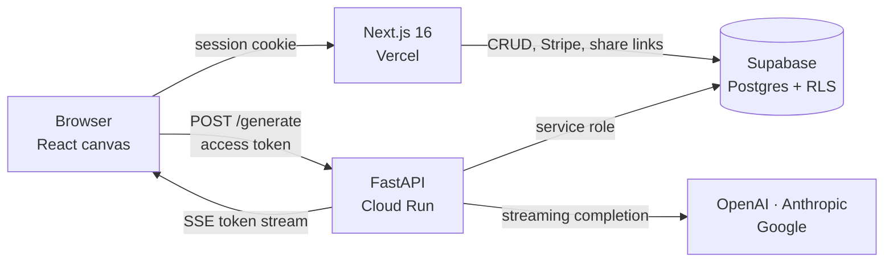

# ChatGRP

A chat app where the conversation is a **graph, not a transcript**.

Every answer is a node on a canvas. Branch from any node to explore a different
follow-up, and the two branches stay completely independent — what you say in
one never leaks into the other. Linear chat forces you to either pollute the
thread with a tangent or abandon it and start over. Here you keep both.

| | |
|---|---|
| **Live app** | https://chatgrp-beta.vercel.app |
| **AI service** | https://chatgrp-ai-sdzuzysyma-uc.a.run.app ([health](https://chatgrp-ai-sdzuzysyma-uc.a.run.app/health)) |

---

## How it works



Two services, deliberately split:

- **`apps/web`** owns everything a user's own session is allowed to touch. It
  talks to Postgres as the user, so row-level security is the access check.
- **`apps/ai`** holds the provider keys and the service-role database
  credential. It never trusts the browser: it verifies the Supabase access
  token locally against the project's JWKS
  ([`auth.py`](apps/ai/app/auth.py)) and re-checks ownership of every session,
  node, and attachment it is asked to read.

Nothing with a provider key or a service-role key ever runs in the browser.

### Branch isolation

The whole product rests on one column: `nodes.parent_id`.

To build the prompt for a node, [`context.py`](apps/ai/app/context.py) walks
`parent_id` from that node up to the root and sends only the messages on that
path. Sibling branches are never visited, so isolation is a property of the
traversal rather than a filter someone has to remember to apply.

```
        root: "explain OAuth"
          │
     ┌────┴────┐
     │         │
  "in Go"   "in Rust"     ← neither branch can see the other
     │
  "add PKCE"               ← context = root → "in Go" → here
```

### A `/generate` request

1. Verify the access token against the cached JWKS.
2. **Concurrently:** the Postgres-backed rate limit, session ownership, and
   whether the plan allows the requested model.
3. **Reserve credits atomically**, before any provider call.
4. Build the branch context; trim to `MAX_INPUT_TOKENS`.
5. Stream the completion back over SSE, persisting tokens as they arrive.
6. On success settle the reservation; on failure or cancel, **refund it**.

Steps 3 and 6 are the reason credits are reserved rather than billed
afterwards: a provider timeout mid-stream must not charge the user, and two
concurrent requests must not both spend the last credit.

Step 2's three reads are independent, so they go out together rather than
paying three serial round trips. They run on threads: `supabase-py` is
synchronous, and calling it straight from an async handler blocks the event
loop for every other request on the worker.

Step 4 is three queries whatever the branch looks like — the node graph, every
message on the path, every attachment on those messages. It used to be one
query per node plus one per message, which made a long conversation
progressively slower to answer.

---

## Stack

| Layer | Choice |
|---|---|
| Frontend | Next.js 16, React 19, Tailwind v4, shadcn/ui |
| Canvas | React Flow (`@xyflow/react`) + Dagre auto-layout |
| State | Zustand |
| Backend | FastAPI (Python 3.13), SSE streaming |
| Database | Supabase Postgres, row-level security on every table |
| Auth | Supabase Auth — email/password + Google OAuth |
| Billing | Stripe Checkout, webhook-driven plan sync |
| Models | OpenAI, Anthropic, Google — behind one router |
| Hosting | Vercel (web) · Cloud Run (AI) |
| Monitoring | Sentry, PostHog — both opt-in by env var |

---

## Repo layout

```
apps/
  web/        Next.js app — UI, route handlers, Stripe, share links
  ai/         FastAPI service — auth, credits, context, provider router
packages/
  shared/     Types, model ids, and pricing shared by both services
supabase/
  migrations/ 0001–0010, applied in order
.github/
  workflows/  CI and the Cloud Run deploy
```

`packages/shared/pricing.json` is the single source of truth for credit costs
and plan limits. TypeScript imports it; the Dockerfile copies it into the AI
image. Changing a price is one edit in one file.

---

## Running locally

**Prerequisites:** Node 22 (`.nvmrc`), pnpm 10+, Python 3.13.

```bash
git clone https://github.com/smitp1402/chatGRP.git
cd chatGRP
pnpm install
```

Create the Python environment for the AI service:

```bash
cd apps/ai
python -m venv .venv
.venv/Scripts/python -m pip install -r requirements.txt   # Windows
# .venv/bin/python -m pip install -r requirements.txt     # macOS / Linux
cd ../..
```

Copy both env templates and fill them in:

```bash
cp apps/web/.env.example apps/web/.env.local
cp apps/ai/.env.example  apps/ai/.env
```

You need a Supabase project (URL + anon key + service-role key) and the
migrations in `supabase/migrations/` applied in order. **Provider API keys are
optional** — `USE_MOCK_AI=true` is the default and streams a fake response, so
the whole app is explorable without spending anything.

Run the two services in separate terminals:

```bash
pnpm dev:web   # http://localhost:3000
pnpm dev:ai    # http://localhost:8000
```

---

## Testing

```bash
pnpm lint        # ESLint
pnpm typecheck   # tsc --noEmit
pnpm test        # Vitest — route handlers, Stripe, pricing
pnpm test:e2e    # Playwright — full browser flows
cd apps/ai && python -m pytest
```

The Python suite runs against an in-memory fake of Supabase
([`tests/fake_db.py`](apps/ai/tests/fake_db.py)), so it needs no database and
no secrets. It covers the parts most likely to lose money or leak data: credit
reservation and refund, branch-context construction, attachment ownership, and
cancel authorization.

## CI/CD

[`ci.yml`](.github/workflows/ci.yml) runs on every PR, path-filtered so a
docs-only change skips the build jobs:

- **web** — lint, typecheck, Vitest, production build
- **ai** — pytest, then a Docker build *and boot*, asserting the container
  comes up as a non-root uid with its bundled pricing file. Proving the image
  builds is not the same as proving it starts.
- **e2e** — Playwright against a dedicated Supabase project, never production.
  Skips cleanly on forks where the secrets are absent.
- **secrets** — gitleaks over the full history, on every PR regardless of path.

[`deploy-ai.yml`](.github/workflows/deploy-ai.yml) deploys the AI service on
merge to `main`. It authenticates with **Workload Identity Federation**, so
GitHub mints a short-lived token per run and there is no service-account JSON
key to leak or rotate. Images are tagged with the commit SHA, and a failing
post-deploy health check leaves the previous revision serving traffic.

[`migrate.yml`](.github/workflows/migrate.yml) applies database migrations on
merge when `supabase/migrations/` changed, so schema and code ship together
rather than the database waiting on someone remembering. Migrations are
additive, so the two workflows do not need sequencing.

The web app deploys through Vercel's own Git integration.

---

## Known limitations

Worth stating plainly rather than leaving to be discovered:

- **Migrations are additive only.** They apply automatically on merge, which
  works because nothing so far drops a column. A destructive change would need
  the migrate and deploy workflows sequenced, or splitting across two deploys.
- **Cloud Run is capped at one instance** while the app is in testing. That is
  a deliberate cost ceiling, not a capacity estimate — one instance serves 80
  concurrent streams, and the cap is a one-line change for launch.
- **Token revocation lags.** Access tokens are verified locally, so a
  signed-out or banned user stays valid until expiry (default 1 hour). That
  tradeoff is documented in [`auth.py`](apps/ai/app/auth.py).
- **Cold starts.** `min-instances: 0` means the first request after an idle
  period waits 3–8 seconds. The assistant bubble names the stage it is in
  rather than showing one static label, so the wait is legible, but it is not
  shorter. A warm instance costs ~$6/month and is one flag away.
- **Attachments on older turns are summarized, not re-sent**, to keep long
  branches affordable. The model knows a file was there but cannot re-read it.
- **Cancels are noticed by polling**, every 3 seconds, so stopping a stream can
  take that long to take effect. `LISTEN/NOTIFY` would make it instant and
  remove the polling, but it needs a direct Postgres connection — and Supabase's
  direct host is IPv6-only, which Cloud Run cannot reach without Direct VPC
  egress on a dual-stack subnet. Not worth that for ten queries a stream.
- **Stripe is in test mode.** The integration is complete and
  signature-verified, but the account is not activated, because there are no
  users to charge.
